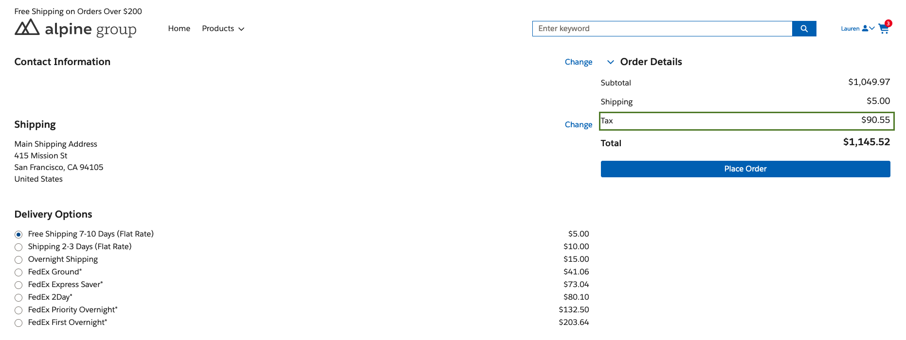
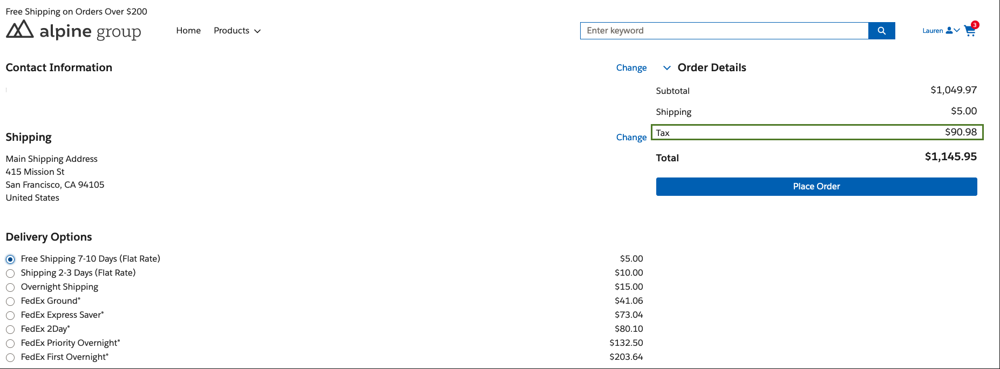
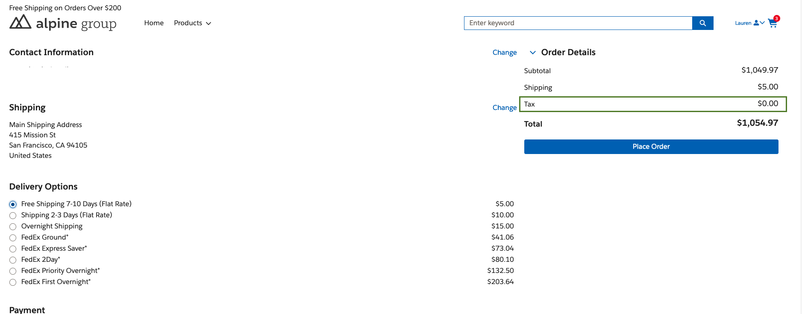

# LWR Extension Framework : Avalara Tax Integration

This repository contains a reference implementation of integrating B2B/D2C commerce with a Avalara tax Provider to get real time taxes for products & shipping..

**Remember** : The integration is built on the Salesforce Commerce Extension framework introduced in the Winter '24 release.
Moving forward, it is essential to prioritize extensions over integrations as they provide more targeted customizations for B2B/D2C stores.

## Capabilities ##
- Using this integration you can get tax calculated for carts
  - Having single/multiple delivery group(s)
  - Having Shipping methods
  - Using product tax codes
  - Supports customer level tax exemption
  - Supports product level tax exemption
- In case a store supports multiple locales/countries , can configure locale specific shipping providers so a store can have multiple shipping providers configured

## Extensibility ##
There are various points where this implementation can be extended to achieve project specific requirement:
  - Meta Data
    - Can add more fields to both the meta data types Tax Provider & HTTP Service
  - Code
     - Following classes can be extended , details are available under respective item number
      - TaxCartCalculatorExtension
      - TaxProvider
      - HTTPService

 ## Limitations  ##
  Currently HTTPS Service supports only JSON (as data format)

 ## Prerequisites  ##
  - Standard object **Product2** should have following attributes to support product based exemption & tax codes.
    - Exemption Code
    - Entity Use Code
    - Taxable
    - Tax Class Id
  - Standard object Account should have following attributes to support account based exemption
    - Exemption Code
    - Entity Use Code

 ## Upcoming Features  ##
  - Logging enhancements
  - HTTP Service - Support for XML data format

## Snapshots ##

### Tax calculation - With shipping non-taxable  ###

### Tax calculation - With shipping taxable  ###

### Tax calculation - With customer tax exemption ###

## Documentation ##
For details , docs can be found here (Use "Tax Integration" as a starting/parent doc):
  - [Tax Integration](./1.SF-LWR_Extension_Framework__Tax_Integration-020724-144018.pdf)
  - [Avalara Tax Integration](./2.SF-LWR_Extension_Framework__Avalara_Tax_Integration-020724-160038.pdf)
  - [Snapshots](./3.SF-Snapshots-020724-160959.pdf)

⚠️ **Warning**: The provided sample code is intended for demonstration purposes only. It is important to refrain from using this source code in a production system without first modifying and thoroughly testing it.