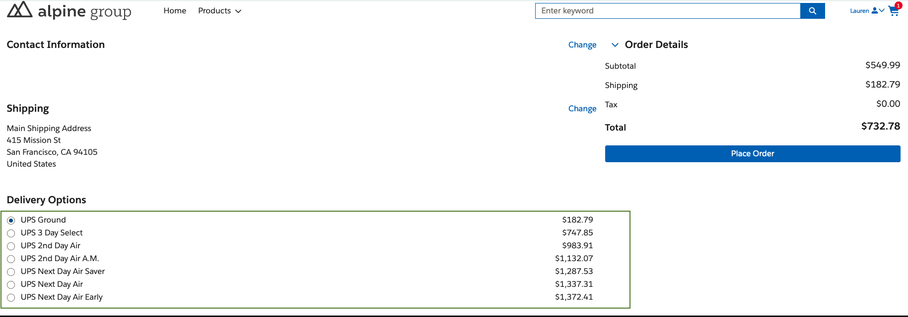
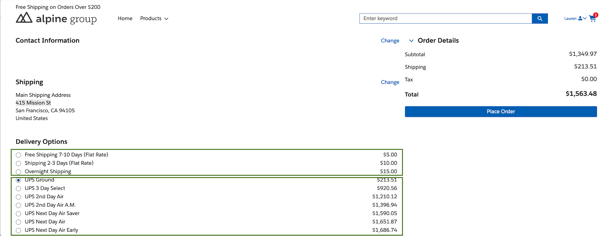

# LWR Extension Framework : UPS Shipping Integration

This repository contains a reference implementation of integrating B2B/D2C commerce with a UPS Shipping Provider to retrieve shipping methods and costs/rates.

**Remember** : The integration is built on the Salesforce Commerce Extension framework introduced in the Winter '24 release.
Moving forward, it is essential to prioritize extensions over integrations as they provide more targeted customizations for B2B/D2C stores.

## Capabilities ##
- Shipping related information can be pre configured like  ,
  - Shipper/Account Number
  - Ship From Address
  - Shipper Address
  - Weight thresholds
  - Shipping Options(shipping methods code & name mapping)
  - Mocked response
- In case a store supports multiple locales/countries , can configure locale specific shipping providers so a store can have multiple shipping providers configured
- Can combine shipping rates from multiple shipping providers (e.g. internal flat rates & UPS rates),
  - On UI,  rates can be displayed grouping by carrier (have to customize LWC component )
  - Also can be sorted using display order (have to customize LWC component )

## Extensibility ##
There are various points where this implementation can be extended to achieve project specific requirement:
  - Meta Data
    - Can add more fields to both the meta data types Shipping Provider & HTTP Service
  - Code
     - Following classes can be extended , details are available under respective item number
      - ShippingCartCalculatorExtension
      - LwrCca_AbstractShippingProvider
      - HTTPService

 ## Limitations  ##
  Currently HTTPS Service supports only JSON (as data format)

 ## Prerequisites  ##
  - Standard object **Product2** should have an attribute **Weight__c** to store a product's weight.
  - There should be a product with **product family** configured as **Shipping (Product2.Family = 'Shipping')** , this product will be used as shipping product 

 ## Upcoming Features  ##
  - Logging enhancements
  - HTTP Service - Support for XML data format

## Snapshots ##

### UPS shipping methods with rates  ###

### UPS shipping methods & rates combined with internal flat rates ###

## Documentation ##
For details , docs can be found here (Use "Shipping Integration (using OAuth)" as a starting/parent doc):
  - [Shipping Integration (using OAuth)](./1.SF-LWR_Extension_Framework_Shipping_Integration_(using_OAuth)-010724-224833.pdf)
  - [UPS Shipping Integration](./2.SF-LWR_Extension_Framework_UPS_Shipping_Integration-010724-225710.pdf)
  - [Flat Shipping Rates](./3.SF-LWR_Extension_Framework_Flat_Shipping_Rates-010724-230330.pdf)

⚠️ **Warning**: The provided sample code is intended for demonstration purposes only. It is important to refrain from using this source code in a production system without first modifying and thoroughly testing it.

